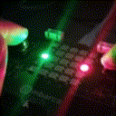

# snake_game



Jogo da cobrinha para a BitDogLab usando a
matriz de LED 5x5 e os botões A e B.

## Exemplo de compilação em GNU/Linux

```
cmake -B build
make -C build
picotool load -f build/snake.uf2
```
