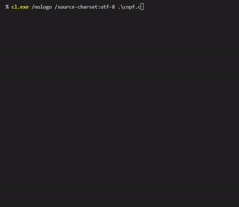

## cnpf: calculadora em notação pós-fixada

_cnpf_ é uma simples calculadora de linha de comando que implementa as 4 operações aritméticas (`+` `-` `*` `/`) e mais outras em inteiros na notação pós-fixada (também conhecida como _Reverse Polish Notation_). [Leia sobre esse tipo de notação aqui.](https://pt.wikipedia.org/wiki/Nota%C3%A7%C3%A3o_polonesa_inversa)

## Instruções de compilação

Compile o arquivo `cnpf.c` com seu compilador de escolha (esse arquivo inclui todos os outros necessários).

## Exemplos

Veja os exemplos ao executar o programa com `./cpnf` ou `.\cnpf.exe` dependendo da sua plataforma.
