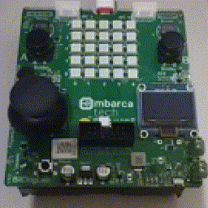

# trafficlight - Atividade 1 (unidade 4, capítulo 5)



## Exemplo de compilação em GNU/Linux

```
cmake -B build
make -C build
picotool load -f build/trafficlight.uf2
```

<!-- vim: set spelllang=pt_br: -->
